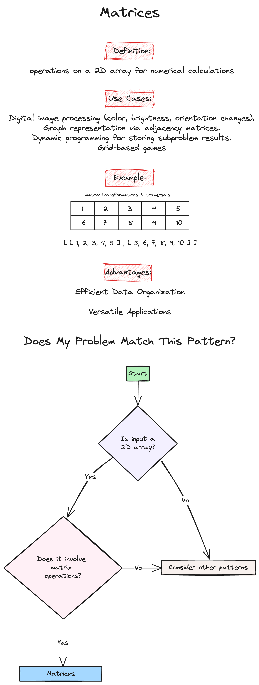

# Week 3: Linked Lists & Matrices

Welcome to the third week of our LeetCode Bootcamp. This week, we will dive into Linked Lists and Matrices in Python, alongside introducing powerful problem-solving patterns.

## Class Agenda (2 Hours)

### 1. Python Overview of Linked Lists and Matrices

Please review the following resources:

- [Programiz: Linked List](https://www.programiz.com/dsa/linked-list)
- [Datacamp: Linked List](https://www.datacamp.com/tutorial/python-linked-lists)
- [Programiz: Matrix](https://www.programiz.com/python-programming/matrix)
- [Python.org: List Data Structure](https://docs.python.org/3/tutorial/datastructures.html)

### 2. Pattern Introduction

- Fast and Slow Pointers 

- In-place Reversal of a Linked List 

- Matrices 

## Take-Home Problems

To help solidify your understanding and practice further, here are some take-home problems:

1. [Palindrome Linked List](https://leetcode.com/problems/palindrome-linked-list/description/)
2. [Reorder List](https://leetcode.com/problems/reorder-list/description/)
3. [Set Matrix Zeroes](https://leetcode.com/problems/set-matrix-zeroes/description/)

Good luck, and happy coding!
